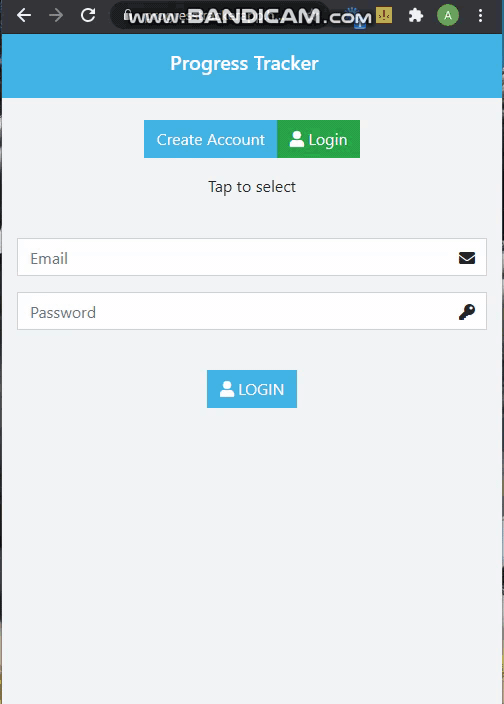

<br />
<p align="center">
  <a href="https://github.com/Abhigyan001/Progress_Tracker.git">
    
  </a>

  <h3 align="center">Rails Api(Backend) with React&Redux(Frontend) --> [Progress Tracker]</h3>

  <p align="center">
    This is the final capstone project of Microverse!
    <br />    
    <br />
    <a href="https://github.com/Abhigyan001/Progress_Tracker/issues">Report Bug</a>
    ·
    <a href="https://github.com/Abhigyan001/Progress_Tracker/issues">Request Feature</a>
  </p>
</p>

<!-- TABLE OF CONTENTS -->
## Table of Contents

* [About the Project](#about-the-project)
  * [Built With](#built-with)
  * [Usage](#usage)
  * [Automated Test](#automated-test)
* [Contributors](#contributors)
* [Acknowledgements](#acknowledgements)
* [License](#license)

<!-- ABOUT THE PROJECT -->
## About The Project

The app is called Progress Tracker and its main functionality is to track how much time an user has spent on separate modules each day.
The requirements can be found [here](https://www.notion.so/Final-Capstone-Project-Tracking-App-22e454da738c46efaf17721826841772) :point_left:

This is the workflow of the app:

- The user is required to register with name, email, password, total hours available for study (300, 270, 240) and how much overall time the user wants to save (i.e. 5%, 10%, 15%, 20%, 25%).

- Selected hours will be divided by numbers of days in a month to derive daily time available for study for each module, and the target saving time; which will be calculated against total progress to see if target is met.

- The user can log in by typing the mail and password.

- The user will be able to manually enter how much time he spent the day on different modules (HTML, CSS, Ruby, RoR, Javascript, and React).

- The user can then access the page with readings and check the total progress made within time.

- The user will see how much time is available to further assign in different modules.

- The user can create multiple entries and keep track of his study progress each day.



### Built With
This project was built using these technologies.
* Rails
* ReactJs
* Redux
* Postgresql
* Heroku Buildpack
* ES6
* Node.js
* ESLint
* StyleLint
* GithubActions :muscle:
* VS Code :vscode:

<!-- INSTALLATION -->
## Usage

To have this app on your pc, you need to:
* Clone this repo:
  - Clone with SSH:
  ```
    git@github.com:Abhigyan001/Progress_Tracker.git
  ```
  - Clone with HTTPS
  ```
    https://github.com/Abhigyan001/Progress_Tracker.git
  ```

* In the project directory, you can run:

  - `$ npm install && bundle install` - installs all the dependencies required by the project
  - `$ rails db:create && rails db:migrate` to create and migrate the tables and build the database.

  - `$ rails server` - will run the local server.
    - Open [http://localhost:3000](http://localhost:3000) to view it in the browser.
    - For each changes in the project the page must be reloaded to view changes.
    - You will also see any lint errors in the console.

## Automated Test
  Open the terminal in the project's root directory and run:
  ```
  $ bundle exec rspec
  ```

## Live Demo & Deployment
The project has been deployed with [Heroku](https://www.heroku.com/)

[Heroku Live Demo Link](https://progresstrackerapp.herokuapp.com/) :point_left:

<!-- CONTACT -->
## Author

👤 **Abhigyan Mahanta**​

- Github: [@githubhandle](https://github.com/Abhigyan001)   
- Linkedin: [Linkedin Profile](https://www.linkedin.com/in/abhigyan001/)
- Twitter: [@Twitter](https://twitter.com/abhigyan_001)

## :handshake: Contributing

To contribute to this project:
- Fork this repository & clone locally.
- Create an upstream remote and sync your local copy.
- Create a new branch.
- Push your code to your origin repository.
- Create a new Pull Request.

## Show your support

Give a :star: if you like this project!

<!-- ACKNOWLEDGEMENTS -->
## Acknowledgements
* Design idea by [Gregoire Vella on Behance](https://www.behance.net/gregoirevella)
* [Microverse](https://www.microverse.org/)
* [Rails Api Documentation](https://api.rubyonrails.org/)
* [React Documentation](https://reactjs.org/docs/getting-started.html)
* [Heroku Documentation](https://devcenter.heroku.com/)

## 📝 License

This project is [MIT](https://opensource.org/licenses/MIT) licensed.
